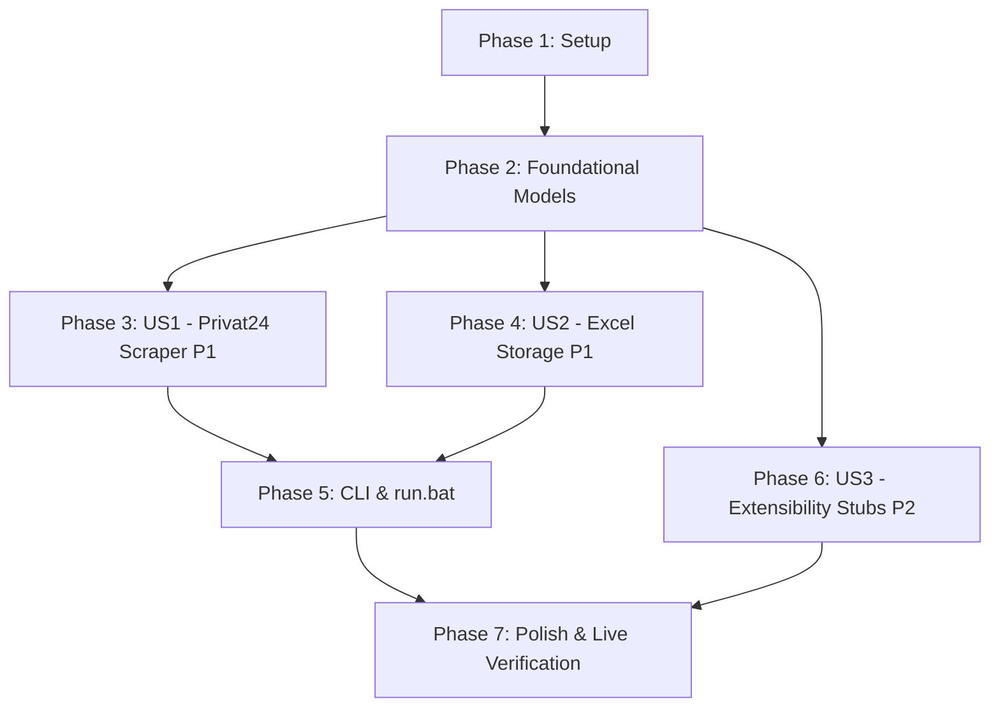

# Завдання розробки: Інструмент збору та збереження даних ринку облігацій в Excel (Bond Yield Analyzer)

**Гілка**: `main` (feature `001-bond-yield-analyzer`) | **Специфікація**: [spec.md](file:///d:/2/specs/001-bond-yield-analyzer/spec.md) | **План**: [plan.md](file:///d:/2/specs/001-bond-yield-analyzer/plan.md)

---

## Phase 1: Setup (Спільна інфраструктура проекту)

**Мета**: Ініціалізація базової структури проекту, оточення та конфігурації інструментів тестування.

- [x] T001 Створити структуру каталогів проекту (`src/bond_collector/`, `src/cli/`, `tests/unit/`, `tests/contract/`, `tests/integration/`) згідно з планом у [plan.md](file:///d:/2/specs/001-bond-yield-analyzer/plan.md)
- [x] T002 Створити файл залежностей [requirements.txt](file:///d:/2/requirements.txt) із бібліотеками `requests>=2.31.0`, `openpyxl>=3.1.0` та `pytest>=8.0.0`
- [x] T003 [P] Створити файл конфігурації тестування [pytest.ini](file:///d:/2/pytest.ini) із реєстрацією маркерів та шляхів пошуку тестів

---

## Phase 2: Foundational (Базові передумови та доменні моделі)

**Мета**: Створення доменних сутностей, моделей даних та базових протоколів, що блокують подальшу реалізацію історій користувача.

**⚠️ КРИТИЧНО**: Реалізація історій користувача не може розпочатися до завершення цієї фази.

- [x] T004 [P] Створити модульні тести моделей даних у [tests/unit/test_models.py](file:///d:/2/tests/unit/test_models.py) (валідація атрибутів `Bond`, `PriceSnapshot`, `CashFlowEvent`, розрахунок статусу доступності `В наявності` / `Розпродано` на основі `count`)
- [x] T005 Реалізувати доменні датакласи `Bond`, `PriceSnapshot` та `CashFlowEvent` у [src/bond_collector/models.py](file:///d:/2/src/bond_collector/models.py) відповідно до [data-model.md](file:///d:/2/specs/001-bond-yield-analyzer/data-model.md)
- [x] T006 [P] Створити тести базових інтерфейсів джерел даних та сховища у [tests/unit/test_interfaces.py](file:///d:/2/tests/unit/test_interfaces.py)
- [x] T007 Реалізувати базові абстрактні класи та протоколи `BaseBondSource` та `BaseStorage` у [src/bond_collector/interfaces.py](file:///d:/2/src/bond_collector/interfaces.py) для забезпечення Принципу I Конституції (Library-First)

**Контрольна точка**: Доменні моделі та протоколи готові — можна переходити до реалізації історій користувачів.

---

## Phase 3: User Story 1 - Збір повного каталогу облігацій, графіків виплат та залишків у наявності (Пріоритет: P1) 🎯 MVP

**Мета**: Автоматизоване підключення до публічного API Приват24, ініціалізація сесії `init`, завантаження переліку випусків `bargaining`, точних залишків `limits` (`operation=s`) та графіків виплат `operations` із захистом від блокувань (jitter 50-100 мс).

**Незалежний тест**: Виклик клієнта API Приват24 повертає повну колекцію об'єктів `Bond` із коректними цінами, дохідностями, залишковою кількістю паперів у наявності (шт.) та графіком грошових потоків.

### Тести для Користувацької історії 1 (TDD) ⚠️
> **ПРАВИЛО TDD: Тести пишуться ПЕРШИМИ та повинні падати до написання коду реалізації**

- [x] T008 [P] [US1] Створити контрактний тест формату відповідей ендпоінтів Приват24 (`init`, `bargaining`, `limits`, `operations`) у [tests/contract/test_api_contract.py](file:///d:/2/tests/contract/test_api_contract.py) згідно з [contracts/privat24_api.md](file:///d:/2/specs/001-bond-yield-analyzer/contracts/privat24_api.md)
- [x] T009 [P] [US1] Створити модульні тести клієнта Приват24 у [tests/unit/test_client.py](file:///d:/2/tests/unit/test_client.py) з мокуванням відповідей HTTP (успішне опитування, оновлення сесії при `session_was_expired`, обробка збоїв мережі retry, коректний парсинг `count: 0` для розкуплених випусків)

### Реалізація для Користувацької історії 1

- [x] T010 [US1] Реалізувати клас `Privat24Client` у [src/bond_collector/client.py](file:///d:/2/src/bond_collector/client.py) (метод `init_session` для отримання `xref` та `pubkey`, метод `get_bonds` для виклику `bargaining`, метод `get_limits` для виклику `limits` з обов'язковим `operation=s`, метод `get_operations` для виклику `operations`)
- [x] T011 [US1] Додати до `Privat24Client` у [src/bond_collector/client.py](file:///d:/2/src/bond_collector/client.py) обробку затримок мікро-троттлінгу (плаваючий jitter 50-100 мс між запитами), таймаути 10 с, автоматичний retry до 2 спроб та оновлення сесії при коді 95
- [x] T012 [US1] Реалізувати координаційний сервіс `CollectorService` у [src/bond_collector/service.py](file:///d:/2/src/bond_collector/service.py) для пакетного опитування всіх паперів каталогу та агрегації результатів у доменні моделі `Bond` з підтримкою часткової відмовостійкості (Graceful degradation)

**Контрольна точка**: Користувацька історія 1 повністю функціональна та протестована в ізоляції.

---

## Phase 4: User Story 2 - Збереження та накопичення історії в Excel як базі даних (Пріоритет: P1)

**Мета**: Створення та синхронізація книги Excel (`bonds.xlsx`) із 3 обов'язковими аркушами («Актуальні котирування», «Історія котирувань», «Графік виплат»), автофільтрами, дедуплікацією денних котирувань, недеструктивним upsert та атомарним збереженням через тимчасовий файл `.bonds.xlsx.tmp`.

**Незалежний тест**: Збереження агрегованих даних створює структурований файл `.xlsx` (або оновлює існуючий), де присутні всі 3 аркуші, дані відсортовані у природному порядку з автофільтрами, старі виплати не зникають, а повторний запуск не плодить однакових рядків за добу.

### Тести для Користувацької історії 2 (TDD) ⚠️

- [ ] T013 [P] [US2] Створити контрактний тест схеми книги Excel у [tests/contract/test_excel_schema.py](file:///d:/2/tests/contract/test_excel_schema.py) (перевірка назв 3 аркушів, точної послідовності колонок, форматів чисел та автофільтрів відповідно до [contracts/excel_schema.md](file:///d:/2/specs/001-bond-yield-analyzer/contracts/excel_schema.md))
- [ ] T014 [P] [US2] Створити модульні тести сервісу збереження у [tests/unit/test_excel_storage.py](file:///d:/2/tests/unit/test_excel_storage.py) (автоматичне створення файлу з нуля, оновлення існуючого файлу, перевірка правила дедуплікації для «Історії котирувань», збереження виплат за складеним ключем `ISIN + Дата + Тип`)
- [ ] T015 [P] [US2] Створити інтеграційний тест транзакційності та блокування файлу у [tests/integration/test_file_locking.py](file:///d:/2/tests/integration/test_file_locking.py) (захист від пошкодження, перехоплення `PermissionError` при відкритому файлі, видалення `.bonds.xlsx.tmp`)

### Реалізація для Користувацької історії 2

- [ ] T016 [US2] Реалізувати генератор нової книги Excel зі структурою 3 аркушів, стилізацією заголовків та налаштуванням ширини колонок у [src/bond_collector/excel.py](file:///d:/2/src/bond_collector/excel.py) (підтримка автостворення файлу з нуля при відсутності за FR-004 та FR-013)
- [ ] T017 [US2] Реалізувати алгоритм недеструктивного оновлення (upsert) для аркуша «Актуальні котирування» та збереження знятих випусків у [src/bond_collector/excel.py](file:///d:/2/src/bond_collector/excel.py)
- [ ] T018 [US2] Реалізувати механізм щоденної дедуплікації для аркуша «Історія котирувань» у [src/bond_collector/excel.py](file:///d:/2/src/bond_collector/excel.py) (запобігання дублікатам записів за поточну дату при незмінних цінах та залишках)
- [ ] T019 [US2] Реалізувати алгоритм недеструктивної синхронізації для аркуша «Графік виплат» у [src/bond_collector/excel.py](file:///d:/2/src/bond_collector/excel.py) (довічне збереження минулих виплат, оновлення статусів «Заплановано»/«Виплачено»)
- [ ] T020 [US2] Реалізувати активацію автофільтрів Excel (`AutoFilter`) на всіх трьох аркушах та атомарне збереження книги через тимчасовий файл `.bonds.xlsx.tmp` з перейменуванням `os.replace` та діагностикою `PermissionError` у [src/bond_collector/excel.py](file:///d:/2/src/bond_collector/excel.py)

**Контрольна точка**: Користувацькі історії 1 та 2 повністю інтегровані та перевірені.

---

## Phase 5: CLI, Інтерфейс запуску та Windows UX (Пріоритет: P1)

**Мета**: Створення зручного консольного інтерфейсу (CLI) з дотриманням стандартів POSIX I/O потоків, машинного формату `--json`, зрозумілих кодів завершення та командного файлу `run.bat` для запуску подвійним кліком у Windows.

**Незалежний тест**: Виклик `python -m src.cli.main` та подвійний клік на `run.bat` успішно запускають оновлення `bonds.xlsx` з інформативним покроковим україномовним прогресом у консолі.

### Тести для CLI & UX

- [ ] T021 [P] Створити інтеграційний тест CLI-інтерфейсу у [tests/integration/test_cli_flow.py](file:///d:/2/tests/integration/test_cli_flow.py) (перевірка запуску за замовчуванням, прапорця `--output`, прапорця `--json`, кодів завершення 0/1/2 та розділення потоків `stdout` і `stderr` відповідно до [contracts/cli.md](file:///d:/2/specs/001-bond-yield-analyzer/contracts/cli.md))

### Реалізація CLI & Windows UX

- [ ] T022 Реалізувати точку входу CLI у [src/cli/main.py](file:///d:/2/src/cli/main.py) (обробка аргументів, зв'язування `CollectorService` та `ExcelStorage`, трансляція україномовного прогресу в `stdout`, вивід помилок блокування файлу та діагностики виключно в `stderr`, підтримка коду повернення 0 при успіху та 1 при помилках)
- [ ] T023 Створити командний файл швидкого запуску [run.bat](file:///d:/2/run.bat) у корені репозиторію (кодування консолі `chcp 65001 > nul` для підтримки української мови, перевірка встановленого Python у системі, запуск `python -m src.cli.main %*` та команда `pause` перед закриттям)

---

## Phase 6: User Story 3 - Модульні точки розширення (заглушки під майбутні цикли) (Пріоритет: P2)

**Мета**: Створення чітких інтерфейсів та розширюваних заглушок для підключення альтернативних брокерів, фонового оновлення та аналітичного модуля розрахунку прибутковості без ускладнення поточного ядра (YAGNI).

**Незалежний тест**: Запуск тестів заглушок підтверджує наявність відкритих точок розширення без конфліктів із основним пайплайном.

- [ ] T024 [P] [US3] Створити модульні тести для точок розширення та заглушок у [tests/unit/test_stubs.py](file:///d:/2/tests/unit/test_stubs.py)
- [ ] T025 [US3] Реалізувати модульні заглушки `MultiBrokerAdapter`, `SchedulerStub` та `YieldCalculatorStub` у [src/bond_collector/stubs.py](file:///d:/2/src/bond_collector/stubs.py) згідно з вимогами FR-008 специфікації

---

## Phase 7: Polish & Cross-Cutting Concerns

**Мета**: Фінальна валідація проекту, наскрізне тестування згідно з `quickstart.md`, підтвердження суворого дотримання мовної політики Конституції (Принцип VI) та перевірка живого збору.

- [ ] T026 [P] Створити наскрізний інтеграційний тест перевірки сценаріїв валідації з [quickstart.md](file:///d:/2/specs/001-bond-yield-analyzer/quickstart.md) у [tests/integration/test_quickstart_validation.py](file:///d:/2/tests/integration/test_quickstart_validation.py)
- [ ] T027 Запустити повний набір автоматизованих тестів (`pytest`) та переконатися у 100% успішному проходженні
- [ ] T028 Перевірити виконання Принципу VI Конституції: усі тексти інтерфейсу, логи у консолі, коментарі та помилки у [src/cli/main.py](file:///d:/2/src/cli/main.py) та [src/bond_collector/](file:///d:/2/src/bond_collector/) складені українською мовою
- [ ] T029 Виконати тестовий запуск [run.bat](file:///d:/2/run.bat) у живому середовищі, перевірити створення файлу [bonds.xlsx](file:///d:/2/bonds.xlsx) та коректність заповнення всіх 3 аркушів реальними даними ОВДП

---

## Залежності та порядок виконання (Dependencies & Execution Order)

### Залежності між фазами

- **Phase 1 (Setup)**: Не має передумов, стартує негайно.
- **Phase 2 (Foundational)**: Залежить від Phase 1; блокує всі історії користувача.
- **Phase 3 (User Story 1)**: Може виконуватися паралельно з Phase 4 після завершення Phase 2.
- **Phase 4 (User Story 2)**: Може виконуватися паралельно з Phase 3 після завершення Phase 2.
- **Phase 5 (CLI & UX)**: Поєднує US1 та US2 для наскрізного виконання.
- **Phase 6 (User Story 3)**: Залежить від базових інтерфейсів Phase 2.
- **Phase 7 (Polish)**: Виконується після завершення всіх фаз.

### Паралельні можливості розробки

- Завдання з позначкою `[P]` мають незалежні файли та можуть виконуватися одночасно:
  - У Phase 1: `T002` та `T003` паралельні.
  - У Phase 2: `T004` та `T006` паралельні.
  - У Phase 3: контрактні та модульні тести `T008` та `T009` паралельні.
  - У Phase 4: тести схеми `T013`, `T014`, `T015` паралельні.
  - Історії `US1` (клієнт API) та `US2` (сховище Excel) можуть реалізовуватися паралельно різними розробниками після завершення Phase 2.

---

## Стратегія реалізації (Implementation Strategy)

### 1. MVP (Мінімально життєздатний продукт)
1. Виконати Phase 1 (Setup) та Phase 2 (Foundational).
2. Виконати Phase 3 (US1 — Privat24 API Client) та переконатися, що всі 40 облігацій, залишки та виплати завантажуються.
3. Додати базову версію Phase 4 (US2 — збереження в Excel) та Phase 5 (`run.bat`).
4. **Валідація MVP**: Запуск `run.bat` генерує перший робочий `bonds.xlsx` із реальними даними.

### 2. Інкрементальне нарощування
- Додавання суворої дедуплікації та захисту від блокування файлів (Phase 4).
- Додавання точок розширення під інші брокери (Phase 6).
- Наскрізний прогін верифікації та полірування (Phase 7).
